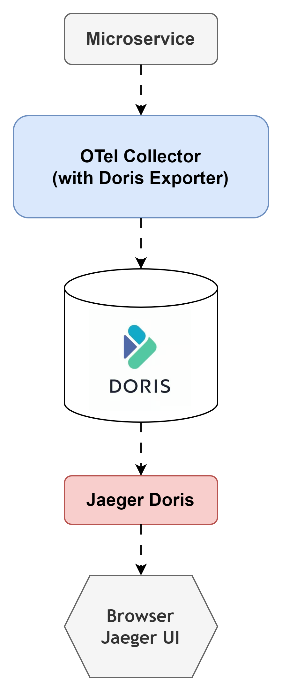

# Jaeger Doris

This service enables querying traces stored in Doris, via the Jaeger UI.
To write traces to Doris, use the [OpenTelemetry Collector, Doris Distribution (still under development)](https://github.com/open-telemetry/opentelemetry-collector-contrib/tree/main/exporter/dorisexporter).

<div align="center">

</div>

## Docker
Docker images exist at [composer000/jaeger-doris](https://hub.docker.com/r/composer000/jaeger-doris) and [composer000/jaeger-doris-all-in-one](https://hub.docker.com/r/composer000/jaeger-doris-all-in-one).
In particular, the all-in-one image is great for testing,
but for production use, consider running `jaegertracing/jaeger-query` and `composer000/jaeger-doris` in separate containers.

## Build
Build the `jaeger-doris` service:

```console
$ make build
```
